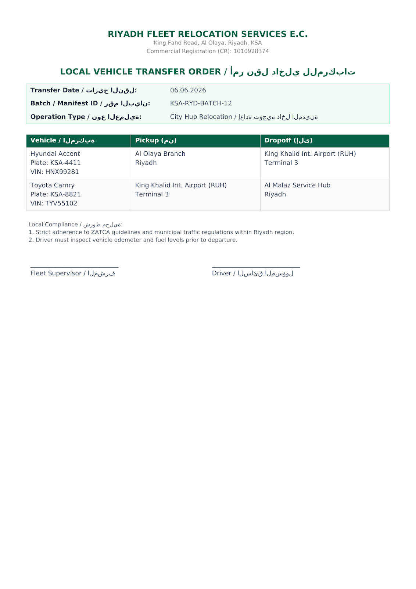

# fleetreloc-oss-preview

> **Disclaimer:** This repository is an independent, personal R&D portfolio project developed strictly on my own time, using my own personal equipment, and without any relation, contribution, or connection to any current or past employers. All concepts, code structures, and architectures presented here are autonomous technical explorations and do not utilize proprietary employer resources or trade secrets.

Public engineering preview of **FleetReloc**, a specialized B2B SaaS platform designed to coordinate bulk vehicle-transport orders (10–30 vehicle fleets), manage transient driver workflows via WhatsApp, and optimize multi-stop routing tailored for the GCC logistics market.

> **Note:** This is a public architectural skeleton and reference implementation. The proprietary business logic, core optimization engines, and production security layers remain private.

---

## Architecture Highlights

* **Monorepo Structure:** Built with a decoupled architecture featuring a FastAPI backend (`apps/api`) and a Next.js 16 / TypeScript frontend (`apps/web`).
* **Bilingual & RTL-Ready Workflows:** Native support for mixed Arabic/English B2B communications, including Right-to-Left (RTL) payload parsing and multilingual NLP extractors for WhatsApp webhook events.
* **Zero-PII & Data Sovereignty:** Engineered for strict regional data residency and privacy standards; driver phone numbers and session mapping are handled ephemerally via Redis, keeping persistent databases clear of permanent personal data.
* **Concurrency & Safety:** Leverages Redis Redlock to ensure race-condition-free, First-Come-First-Served (FCFS) driver job-claiming mechanics over WhatsApp webhooks.
* **Resilient Routing & Ingestion:** Hybrid architecture combining Google OR-Tools / OSRM fallbacks for vehicle routing problem (VRP) optimization and structured OCR text parsing supporting both enterprise cloud LLMs and self-hosted local inference runtimes (e.g., Ollama / vLLM) optimized for multilingual (Arabic/English) document parsing with zero data leakage.
* **Pluggable Notification Architecture:** Decoupled multi-channel driver notification engine built using the Strategy and Factory patterns (`DriverNotifier` interface). Seamlessly switches between Telegram Bot API (for local R&D and rapid MVP testing) and Bird/WhatsApp Business API (for GCC production environments) without altering core booking or dispatch logic.
* **Zero-Trust Identity & Hashing Core:** Implemented a strict Zero-Trust ingestion pipeline (`identity.py`) that normalizes raw contact inputs (WhatsApp, Telegram, phone numbers) and maps them into irreversible, salted HMAC-SHA256 `driver_hash` identifiers. Persistent databases and logs are strictly guarded against storing raw PII, ensuring full GDPR/PDPL compliance.
* **Demo Magic Number Routing:** Features an isolated, configuration-driven "Magic Number" override (`DEMO_MAGIC_PHONE`) that safely reroutes dispatch notifications to a mock Telegram chat ID during live presentations and automated test suites, keeping real driver credentials completely untouched.
* **Iterative Bulk Batch & Broadcast Waves:** Relocation orders (10–30 vehicles) are managed via structured `BulkBatch` and `BroadcastWave` relational models. Notifications are distributed in iterative waves targeting exclusively `driver_hash` arrays, eliminating persistent PII exposure while maintaining precise First-Come-First-Served (FCFS) tracking.

---

## How It Works: Zero-Trust Ingestion & Dispatch Flow

FleetReloc solves a core logistical challenge: coordinating multi-vehicle transport orders while maintaining absolute compliance with regional data privacy laws (GDPR/PDPL) and zero-trust security standards. 

Here is how the pipeline operates end-to-end:

1. **Manifest Ingestion & Parsing:**
   * Dispatchers upload transport orders (manifests/spreadsheets or images via OCR) containing vehicle details and driver contact identifiers (WhatsApp numbers or Telegram handles).

2. **Zero-Trust Normalization & Hashing (`identity.py`):**
   * **No PII Persistence:** Raw contact strings are intercepted at the API boundary, normalized (E.164 phone formatting / Telegram handle sanitization), and mapped into a salted, irreversible **`driver_hash`** (HMAC-SHA256).
   * **Database Safety:** PostgreSQL stores *only* the `driver_hash` and relational statuses. Raw phone numbers or handles are **never** written to persistent storage or application logs.

3. **Iterative Broadcast Waves (`BulkBatch` & `BroadcastWave`):**
   * Orders are grouped into a `BulkBatch` (e.g., 10–30 vehicles). 
   * Instead of broadcasting to the entire pool at once, the system generates structured **`BroadcastWave`** records. Each wave targets an array of `driver_hash` items iteratively.
   * If a wave expires without being claimed, the next wave is automatically unlocked.

4. **Live Demo Mode ("Magic Number" Override):**
   * For live presentations, code reviews, or automated end-to-end tests, the system recognizes a designated `DEMO_MAGIC_PHONE` fixture. 
   * It securely reroutes notifications to a pre-configured `DEMO_TELEGRAM_CHAT_ID` without ever exposing or executing real driver PII in public or testing environments.

5. **Race-Condition-Free Claiming (FCFS):**
   * When a driver responds via WhatsApp/Telegram webhook, Redis Redlock coordinates atomic slot-claiming, ensuring First-Come-First-Served fairness without race conditions.

---

## Core Documentation

* [`api_protocols.md`](docs/api_protocols.md) — Authoritative contracts covering WABA webhooks, routing schemas, error codes, and real-time event specs.
* [`db_schema.md`](docs/db_schema.md) — PostgreSQL / Supabase DDL definitions, state machines, and multi-tenant RLS isolation rules.

### 📄 Sample Ingestion Document
Here is a synthetic example of a bilingual (English/Arabic) transport manifest (`local_order_ksa.png`) processed by the OCR and LLM pipeline to automatically extract batch payloads, vehicles (Hyundai, Toyota), and Riyadh-based coordinates:

> *Note: All company names, Commercial Registration (CR) numbers, and addresses shown in the sample above are entirely synthetic and generated solely for R&D demonstration purposes.*

---

## Tech Stack

* **Backend:** Python 3.11+, FastAPI, SQLAlchemy 2.0, Alembic, Pydantic v2, Redis (Redlock).
* **AI / Parsing:** OpenAI API / Self-hosted Local LLM Nodes (Ollama / vLLM compatible) with fine-tuned Arabic/English extraction pipelines.
* **Frontend:** Next.js, React, Tailwind CSS, TypeScript (RTL/BiDi layout support).
* **Infrastructure:** Docker, Supabase (PostgreSQL), OSRM.

